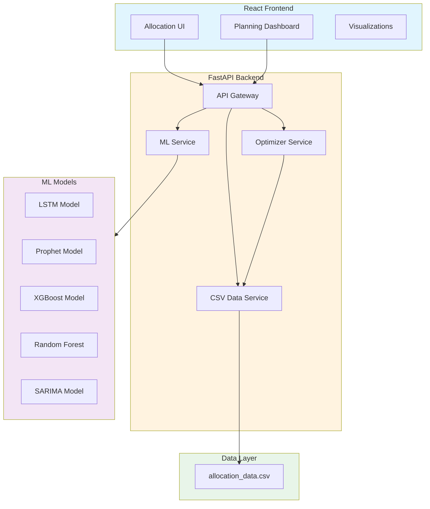
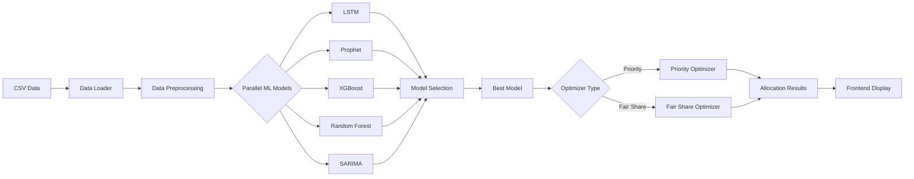
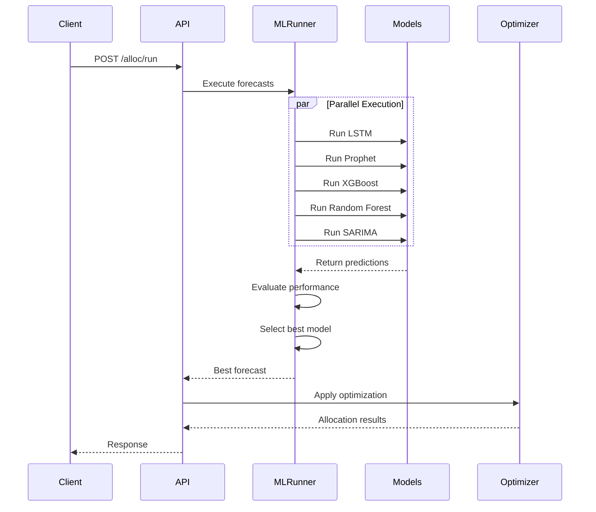
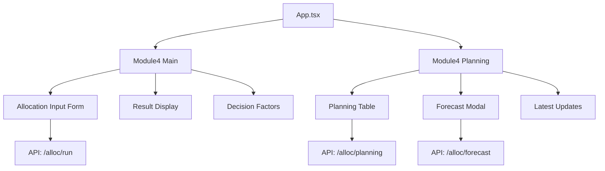

# Module 4 — Allocation Maximizer
Optimizing Supply Distribution with ML-Powered Intelligence  
*Technical Specification & Implementation Guide*  
*Version: October 2024*

---

## 1. Executive Summary

The **Allocation Maximizer** is an ML-powered module that optimally allocates constrained supply across multiple distribution centers (DCs) and customers. It leverages multiple forecasting models running in parallel, selects the best-performing model, and applies either Priority-based or Fair Share optimization strategies to maximize fulfillment rates while respecting business constraints.

### Key Features
- **Parallel ML Model Execution**: LSTM, Prophet, XGBoost, Random Forest, and SARIMA models compete for best performance
- **Dual Optimization Modes**: Priority-based (respects DC priorities) and Fair Share (proportional distribution)
- **Substitution Logic**: Intelligent SKU substitution when primary inventory is insufficient
- **Real-time Dashboard**: Interactive planning interface with allocation visualizations
- **CSV-based Data Storage**: Simple, maintainable data management without database complexity

---

## 2. System Architecture

### 2.1 High-Level Architecture



### 2.2 Data Flow Diagram



---

## 3. Project Structure

### 3.1 Backend Structure

```
backend/api/module4/
├── main.py                     # FastAPI application entry point
├── requirements.txt            # Python dependencies
├── config.py                   # Configuration settings
├── models/
│   ├── __init__.py
│   ├── data_models.py          # Pydantic models for validation
│   ├── allocation.py           # Allocation result models
│   └── request_models.py       # API request/response models
├── services/
│   ├── __init__.py
│   ├── csv_service.py          # CSV data loading and caching
│   ├── ml_runner.py            # Parallel ML model execution
│   ├── forecast_service.py     # Forecasting orchestration
│   ├── optimizer.py            # Priority & Fair Share optimizers
│   └── substitution.py         # SKU substitution logic
├── routers/
│   ├── __init__.py
│   ├── allocation.py           # Allocation endpoints
│   ├── forecast.py             # Forecasting endpoints
│   └── health.py               # Health check endpoints
├── ml_models/
│   ├── __init__.py
│   ├── model_wrapper.py        # Unified interface for ML models
│   ├── lstm_wrapper.py         # LSTM model wrapper
│   ├── prophet_wrapper.py      # Prophet model wrapper
│   ├── xgboost_wrapper.py      # XGBoost model wrapper
│   ├── rf_wrapper.py           # Random Forest wrapper
│   └── sarima_wrapper.py       # SARIMA model wrapper
└── utils/
    ├── __init__.py
    ├── metrics.py              # Performance metrics
    └── helpers.py              # Utility functions
```

### 3.2 Frontend Structure

```
frontend/
├── src/
│   ├── pages/
│   │   ├── module4.jsx         # Main allocation page
│   │   └── module4_planning.jsx # Planning dashboard
│   ├── components/
│   │   ├── module4/
│   │   │   ├── allocation_input_form.jsx  # Input form for allocation
│   │   │   ├── planning_table.jsx         # Allocation results table
│   │   │   ├── forecast_modal.jsx         # Forecast visualization
│   │   │   ├── decision_factors_table.jsx # Decision factors display
│   │   │   ├── result_table.jsx           # Results display
│   │   │   └── latest_allocation_updates_table.jsx
│   │   └── examples/           # JSON mock data
│   └── App.tsx                 # Main app router
├── package.json
└── vite.config.ts
```

---

## 4. Data Model

### 4.1 CSV Schema

The system uses a single comprehensive CSV file: `data/allocation_data.csv`

| Column Name | Type | Description | Example |
|------------|------|-------------|---------|
| dc_id | string | Distribution Center ID | DC001 |
| dc_name | string | DC Name | Chicago DC |
| dc_location | string | DC Location | Chicago, IL |
| dc_region | string | DC Region | North America |
| dc_priority | integer | Priority level (1-5) | 5 |
| sku_id | string | SKU identifier | SKU-NET-001 |
| sku_name | string | Product name | Network Switch 48-Port |
| sku_category | string | Product category | Networking |
| customer_id | string | Customer identifier | CUST-001 |
| customer_name | string | Customer name | TechCorp Inc |
| customer_tier | string | Customer tier | Strategic |
| customer_region | string | Customer region | North America |
| current_inventory | integer | Current stock level | 500 |
| forecasted_demand | integer | Predicted demand | 450 |
| historical_demand | integer | Past period demand | 420 |
| revenue_per_unit | float | Revenue per unit | 1250.00 |
| cost_per_unit | float | Cost per unit | 950.00 |
| margin | float | Profit margin % | 24.0 |
| sla_level | string | Service level agreement | Gold |
| risk_score | float | Risk assessment (0-1) | 0.15 |
| substitution_sku_id | string | Alternative SKU | SKU-NET-002 |
| date | date | Record date | 2024-10-14 |
| allocated_quantity | integer | Allocated amount | 400 |
| fulfillment_rate | float | Fulfillment percentage | 88.9 |
| lead_time_days | integer | Delivery lead time | 3 |
| min_order_quantity | integer | Minimum order qty | 10 |
| safety_stock | integer | Safety stock level | 50 |

---

## 5. API Specification

### 5.1 Endpoints

#### Health Check
```http
GET /api/health
```
Returns service health status and version information.

#### Run Allocation
```http
POST /api/alloc/v1/run
```
**Request Body:**
```json
{
  "batch_id": "BATCH-2024-10-14",
  "optimizer_type": "priority",  // or "fairshare"
  "parameters": {
    "forecast_horizon": 30,
    "include_substitutions": true,
    "risk_threshold": 0.3
  }
}
```

**Response:**
```json
{
  "batch_id": "BATCH-2024-10-14",
  "status": "completed",
  "optimizer_used": "priority",
  "model_used": "xgboost",
  "model_performance": {
    "rmse": 12.5,
    "mae": 10.2,
    "mape": 8.5
  },
  "allocation_summary": {
    "total_demand": 5000,
    "total_allocated": 4500,
    "fulfillment_rate": 90.0,
    "substitutions_used": 120
  },
  "allocations": [
    {
      "dc_id": "DC001",
      "customer_id": "CUST-001",
      "sku_id": "SKU-NET-001",
      "allocated_qty": 400,
      "demanded_qty": 450,
      "substitution_used": false
    }
  ]
}
```

#### Get Current Inventory
```http
GET /api/alloc/v1/inventory
```
Returns current inventory levels across all DCs and SKUs.

#### Get Forecast
```http
GET /api/alloc/v1/forecast
```
Returns demand forecasts from the best-performing model.

#### Run Specific Optimizer
```http
POST /api/alloc/v1/optimize/{type}
```
Where `{type}` is either `priority` or `fairshare`.

#### Get Planning Data
```http
GET /api/alloc/v1/planning
```
Returns aggregated data for the planning dashboard.

---

## 6. ML Models Integration

### 6.1 Model Pipeline



### 6.2 Model Selection Criteria

Models are evaluated based on:
- **RMSE** (Root Mean Square Error)
- **MAE** (Mean Absolute Error)
- **MAPE** (Mean Absolute Percentage Error)
- **Execution Time**

The model with the lowest weighted error score is selected for the final allocation.

---

## 7. Optimization Algorithms

### 7.1 Priority Optimizer

```python
def priority_optimizer(demand, inventory, dc_priorities):
    """
    Allocates inventory based on DC priorities.
    Higher priority DCs get preference.
    """
    1. Sort DCs by priority (descending)
    2. For each DC in priority order:
        - Allocate min(demand, available_inventory)
        - Update remaining inventory
    3. Apply substitution logic for unmet demand
    4. Return allocation matrix
```

### 7.2 Fair Share Optimizer

```python
def fairshare_optimizer(demand, inventory):
    """
    Distributes inventory proportionally based on demand.
    """
    1. Calculate total demand across all DCs
    2. For each DC:
        - allocation_ratio = dc_demand / total_demand
        - allocated = min(inventory * allocation_ratio, dc_demand)
    3. Redistribute any remaining inventory
    4. Return allocation matrix
```

---

## 8. Railway Deployment

### 8.1 Backend Deployment Configuration

**railway.json**
```json
{
  "build": {
    "builder": "NIXPACKS",
    "buildCommand": "pip install -r backend/api/module4/requirements.txt"
  },
  "deploy": {
    "startCommand": "cd backend/api/module4 && uvicorn main:app --host 0.0.0.0 --port $PORT",
    "restartPolicyType": "ON_FAILURE",
    "restartPolicyMaxRetries": 3
  }
}
```

**Environment Variables:**
```
PYTHON_VERSION=3.11
ENVIRONMENT=production
CSV_PATH=/data/allocation_data.csv
REDIS_URL=${{Redis.REDIS_URL}}
LOG_LEVEL=info
CORS_ORIGINS=https://your-frontend-domain.railway.app
```

### 8.2 Frontend Deployment Configuration

**Build Command:**
```bash
npm install && npm run build
```

**Start Command:**
```bash
npm run preview -- --port $PORT --host 0.0.0.0
```

**Environment Variables:**
```
VITE_API_URL=https://your-backend-domain.railway.app
NODE_ENV=production
```

### 8.3 Database/Storage

**Redis Configuration** (for caching):
- Add Redis service in Railway
- Used for caching CSV data and model results
- TTL: 15 minutes for forecast cache

**Volume Mount** (for CSV data):
- Mount path: `/data`
- Upload `allocation_data.csv` to the volume

---

## 9. Testing Strategy

### 9.1 Unit Tests

```python
# test_csv_service.py
def test_load_csv_data():
    """Test CSV data loading and parsing"""
    
def test_data_validation():
    """Test data validation and cleaning"""

# test_optimizers.py
def test_priority_optimizer():
    """Test priority-based allocation"""
    
def test_fairshare_optimizer():
    """Test fair share allocation"""

# test_ml_wrappers.py
def test_model_execution():
    """Test individual model wrappers"""
    
def test_parallel_execution():
    """Test parallel model running"""
```

### 9.2 Integration Tests

```python
# test_allocation_flow.py
def test_end_to_end_allocation():
    """Test complete allocation workflow"""
    
def test_api_endpoints():
    """Test all API endpoints"""
    
def test_model_selection():
    """Test model selection logic"""
```

### 9.3 Performance Tests

```python
# test_performance.py
def test_large_csv_handling():
    """Test with 10,000+ row CSV"""
    
def test_parallel_model_performance():
    """Benchmark parallel execution"""
    
def test_api_response_times():
    """Ensure <2s response times"""
```

### 9.4 Test Coverage Requirements

- **Unit Tests**: >80% coverage
- **Integration Tests**: All critical paths
- **Performance Tests**: Load testing with 100 concurrent users

### 9.5 Testing Commands

```bash
# Run all tests
pytest backend/api/module4/tests/

# Run with coverage
pytest --cov=backend/api/module4 --cov-report=html

# Run specific test suite
pytest backend/api/module4/tests/unit/

# Run performance tests
pytest backend/api/module4/tests/performance/ -v
```

---

## 10. Frontend Components

### 10.1 Component Flow



### 10.2 Component Descriptions

| Component | Purpose | API Integration |
|-----------|---------|----------------|
| `module4.jsx` | Main allocation interface | `/alloc/run` |
| `module4_planning.jsx` | Planning dashboard | `/alloc/planning` |
| `allocation_input_form.jsx` | Input parameters | - |
| `planning_table.jsx` | Display allocation results | `/alloc/results` |
| `forecast_modal.jsx` | Visualize forecasts | `/alloc/forecast` |
| `decision_factors_table.jsx` | Show decision criteria | - |

---

## 11. Monitoring & Observability

### 11.1 Metrics to Track

- **System Metrics**
  - API response times
  - Model execution times
  - Memory usage
  - CPU utilization

- **Business Metrics**
  - Average fulfillment rate
  - Substitution usage rate
  - Allocation accuracy
  - Model performance over time

### 11.2 Logging

```python
import logging

logging.basicConfig(
    level=logging.INFO,
    format='%(asctime)s - %(name)s - %(levelname)s - %(message)s'
)

# Log important events
logger.info(f"Allocation batch {batch_id} started")
logger.info(f"Model {model_name} selected with RMSE: {rmse}")
logger.info(f"Allocation completed: {fulfillment_rate}% fulfillment")
```

---

## 12. Security Considerations

### 12.1 API Security
- CORS configuration for frontend domain only
- Rate limiting: 100 requests per minute
- Input validation using Pydantic models
- SQL injection prevention (not applicable with CSV)

### 12.2 Data Security
- CSV files stored in protected volume
- No sensitive data in logs
- Environment variables for configuration
- HTTPS only in production

---

## 13. Performance Optimization

### 13.1 Caching Strategy
- Cache CSV data in memory on startup
- Cache model predictions for 15 minutes
- Use Redis for distributed caching

### 13.2 Parallel Processing
```python
from concurrent.futures import ProcessPoolExecutor

def run_models_parallel(data):
    with ProcessPoolExecutor(max_workers=5) as executor:
        futures = {
            executor.submit(run_lstm, data): "lstm",
            executor.submit(run_prophet, data): "prophet",
            executor.submit(run_xgboost, data): "xgboost",
            executor.submit(run_rf, data): "rf",
            executor.submit(run_sarima, data): "sarima"
        }
        results = {}
        for future in futures:
            model_name = futures[future]
            results[model_name] = future.result()
    return results
```

---

## 14. Troubleshooting Guide

### Common Issues and Solutions

| Issue | Cause | Solution |
|-------|-------|----------|
| Slow API responses | Large CSV processing | Implement caching, reduce data size |
| Model failures | Missing dependencies | Check requirements.txt |
| Allocation imbalance | Wrong optimizer | Switch optimizer type |
| Frontend connection errors | CORS issues | Update CORS settings |
| Out of memory | Large model execution | Increase Railway instance size |

---

## 15. Future Enhancements

### Phase 2 Features
- Real-time data updates via WebSocket
- A/B testing for optimizer selection
- Custom ML model upload
- Multi-objective optimization
- Historical allocation analysis
- Export to Excel/PDF reports

### Phase 3 Features
- GraphQL API option
- Microservices architecture
- Kubernetes deployment
- Real-time collaboration
- Advanced visualization dashboards
- Integration with ERP systems

---

## 16. Appendix

### 16.1 Sample CSV Data Structure

```csv
dc_id,dc_name,dc_location,dc_region,dc_priority,sku_id,sku_name,sku_category,customer_id,customer_name,customer_tier,customer_region,current_inventory,forecasted_demand,historical_demand,revenue_per_unit,cost_per_unit,margin,sla_level,risk_score,substitution_sku_id,date,allocated_quantity,fulfillment_rate,lead_time_days,min_order_quantity,safety_stock
DC001,Chicago DC,Chicago IL,North America,5,SKU-NET-001,Network Switch 48-Port,Networking,CUST-001,TechCorp Inc,Strategic,North America,500,450,420,1250.00,950.00,24.0,Gold,0.15,SKU-NET-002,2024-10-14,400,88.9,3,10,50
```

### 16.2 API Testing with cURL

```bash
# Health check
curl http://localhost:8000/api/health

# Run allocation
curl -X POST http://localhost:8000/api/alloc/v1/run \
  -H "Content-Type: application/json" \
  -d '{
    "batch_id": "TEST-001",
    "optimizer_type": "priority"
  }'

# Get inventory
curl http://localhost:8000/api/alloc/v1/inventory

# Get forecast
curl http://localhost:8000/api/alloc/v1/forecast
```

### 16.3 Docker Deployment (Alternative)

```dockerfile
# Dockerfile for backend
FROM python:3.11-slim

WORKDIR /app

COPY backend/api/module4/requirements.txt .
RUN pip install --no-cache-dir -r requirements.txt

COPY backend/api/module4 .
COPY data/allocation_data.csv /data/

EXPOSE 8000
CMD ["uvicorn", "main:app", "--host", "0.0.0.0", "--port", "8000"]
```

---

*Last Updated: October 2024*  
*Version: 1.0.0*  
*Module 4 - Allocation Maximizer*